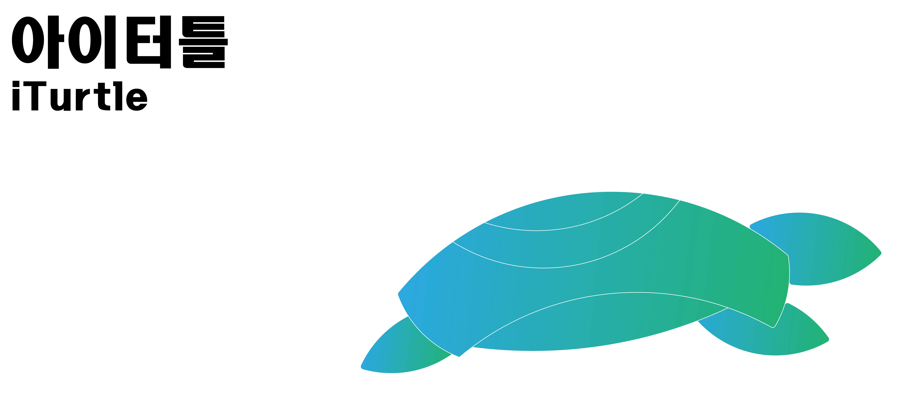

## iTurtle Overview
OROCA 네이버 카페의 지역모임인 오로카 판교지역모임의 미니프로젝트인 '아이터틀'은 터틀봇3을 베이스로 하여 미니 버전을 만들고 있습니다.
- 오로카 네이버카페 : https://cafe.naver.com/openrt
- 오로카 판교지역모임 : http://bit.ly/메이커스판교
  

## Contributors
- 최규남 / robertchoi / Leader
- 크리스천 / christian / Designer / christian.piponides@gmail.com
- 하지현 / Hardware -> Software / dldudvy777@gmail.com
- 설윤호 / 단국대 기계 Hardware / syh9594@gmail.com
- 김세진 / programmer / dev.napier@gmail.com
- 이창주 / programmer / rookiecj@gmail.com

## Contributing, feedback, contact
Any kind of feedback/criticism would be greatly appreciated (software design, documentation, improvement ideas, spelling mistakes, etc...).

If you'd like to see some features or algorithms implemented in iTurtleAlpha, please let us know!

Please feel free to contribute (see guidelines) and send pull requests!

For bugs, issues or questions about iTurtleAlpha, you can use the GitHub project page (please don't send me emails as there would be no record for other users).
